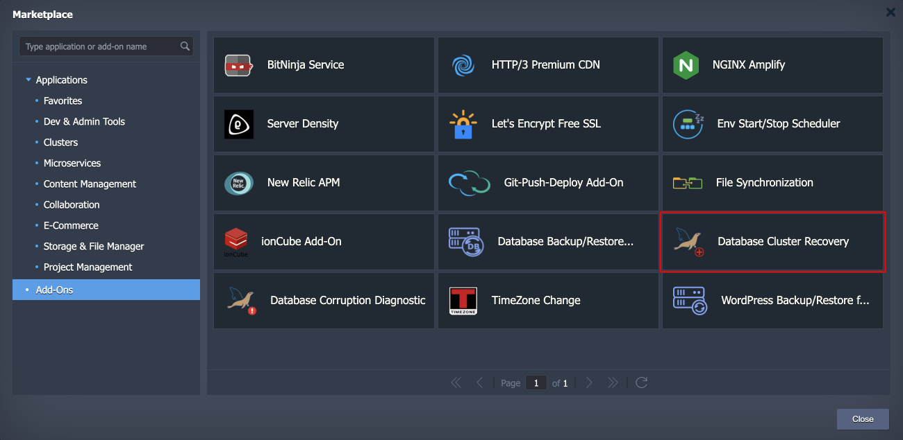
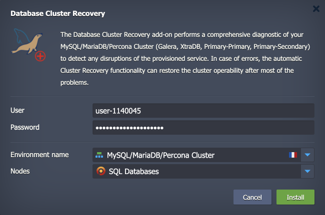
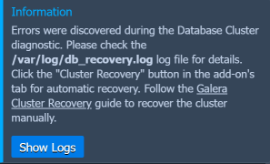

# Restore and Recovery Add-On for Multi-Region SQL Clusters

The [Multi-Region SQL Auto-Clustering](https://www.virtuozzo.com/company/blog/mysql-mariadb-database-auto-clustering-cloud-hosting/) solution is packaged as an advanced highly available and auto-scalable cluster on top of managed certified dockerized stack templates. Once the database failed and becomes inaccessible you can use this automated solution for database restoration and even recovery of fully corrupted node.

The list of supported DB clusters for recovering:

- Primary-Secondary Cluster based on MariaDB/MySQL/Percona stacks
- Primary-Primary Cluster based on MariaDB/MySQL/Percona stacks
- Galera Cluster based on MariaDB stack
- XtraDB Cluster based on Percona stack

With help of the add-on you can carry out cluster diagnostic and take a decision how to get database cluster back into operation. The diagnostic flow is based on:

- getting the topology scheme (Primary-Secondary, Primary-Primary, Galera, XtraDB)
- getting the status of each node
- providing a recovery method related to scheme and status to the end user

## Add-On Installtion

The add-on can be installed either automatically along with multi-region database cluster installation or manually from [Marketplace](https://www.virtuozzo.com/application-platform-docs/marketplace/) of the Virtuozzo Application Platform. It is considered that you have already an account on one of [Hosting Service Providers](https://www.virtuozzo.com/application-platform-partners/). So, if you have no add-on installed, sing in to the platform, open **Add-Ons** section in the Marketplace and pick **Database Cluster Recovery** add-on.

### Installation Process

In the opened confirmation window, provide the required data:

- **User** and **Password** - the database admin user credentials
- **Environment name** - select an environment with the required database cluster from the list
- **Nodes** - choose a layer with the database cluster

Click **Install** and wait for the successful installation. The add-on will appear in the list of add-ons of *sqldb* layer and is ready for utilization.

### Database Recovery How To

The add-on allows doing two actions:

- **Cluster Diagnostic** - with this action, the add-on automatically scans all nodes in the cluster in order to identify whether the nodes are accessible and whether databases are consistent. If during diagnostic the database corruption or even node failure is detected, the add-on will warn you with a respective pop-up window:

> **Tip:** Cluster diagnostic is triggered automatically before the **environment stop** and **cloudlets change** operations. The respective actions will proceed only if the database integrity is verified (to avoid additional damage to the cluster).

- **Cluster Recovery** - if any failure has been detected, you can either try automatic database recovery by pressing the **Cluster Recovery** button or perform manual database recovery by following the link to the recovery guide. The best practice is to use the automatic recovery scenario.

To perform automatic recovery, provide database user credentials either you got upon database cluster installation or the credentials of another privileged user you created.

In case the automatic recovery fails and you go with manual recovery flow, first look at the ***/var/log/db_recovery.log*** file to better understand the nature of the detected error. Then you can try to recover using our guide following the link in the **Information** window and official documentation from [MySQL](https://mysql.org)/[MariaDB](https://mariadb.org)/[Percona](https://www.percona.com/) teams.
